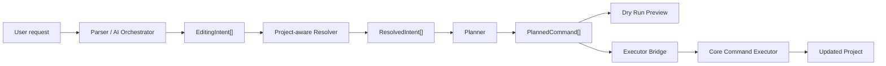
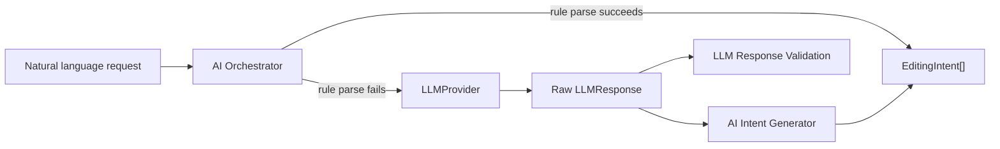
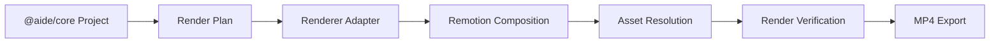
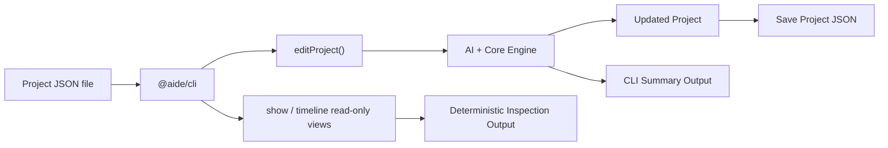
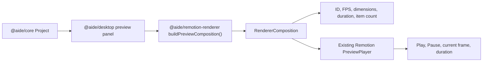
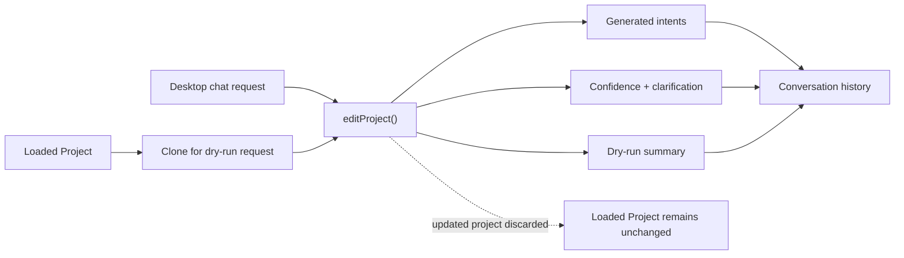
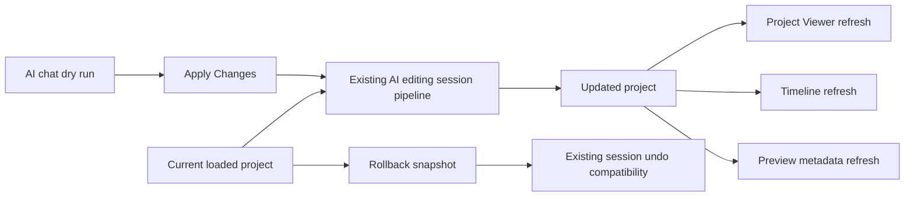

# Project Overview

> Whenever a significant project capability changes, PROJECT_STATUS.md must be updated in the same change set so documentation remains synchronized with implementation.

AI Video Editor / AI Documentary Editor is a modular editing system for turning structured projects and natural-language editing requests into deterministic project updates and video renders.

The project currently focuses on five foundations:

- A reliable core editing engine with projects, timelines, commands, snapshots, replay, and persistence.
- A Remotion-based rendering boundary for previews, render plans, asset resolution, verification, and MP4 export.
- An AI command interpretation package that converts requests into structured editing intents, plans, dry runs, execution, confidence analysis, and clarification support.
- A CLI for editing, chat sessions, OpenAI validation, project inspection, and timeline visualization.
- An Electron desktop shell foundation for launching the future desktop product.

The system is intentionally layered so AI features route through the same command execution infrastructure as deterministic rule-based edits.

# Current Architecture

## Packages

### @aide/core

Responsible for the editing engine and domain model.

Includes:

- Project model and metadata.
- Scene model and scene construction.
- Timeline tracks, clips, markers, transitions, and validation.
- Asset assignment and analysis.
- Command envelopes, command handlers, and command execution.
- Undo/redo-oriented history primitives.
- Replay and replay verification.
- Project persistence and deterministic serialization.
- Snapshots and rollback restoration.
- Render plan primitives used by renderer-facing packages.

### @aide/remotion-renderer

The renderer package is currently implemented in this repository as `@ai-documentary-editor/remotion-renderer`, and represents the `@aide/remotion-renderer` architecture boundary.

Responsible for turning core render plans into Remotion preview and export behavior.

Includes:

- Preview builder.
- Preview player foundations.
- Documentary composition generation.
- Render item components.
- Render plan adapter.
- Asset resolution.
- MP4 export.
- Render verification.
- Smoke render workflow.

### @aide/ai-command-interpreter

Responsible for converting editing requests into deterministic editing behavior.

Includes:

- Rule-based intent parsing.
- Multi-intent parsing.
- AI intent generation through provider-agnostic `LLMProvider`.
- OpenAI provider foundation.
- LLM response validation.
- Project-aware resolver.
- Planner.
- Dry-run preview.
- Executor bridge into `@aide/core`.
- Editing session pipeline.
- AI orchestrator.
- AI editing session.
- Intent confidence analysis.
- Clarification engine.
- Conversation context.
- Session undo.
- Unified public API: `editProject()`.

### @aide/cli

Responsible for command-line access to project editing and inspection.

Includes:

- `aide edit <project-file> "<request>"`
- `aide chat <project-file>`
- `aide show <project-file>`
- `aide timeline <project-file>`
- `aide validate-openai`
- `aide preview` foundation stub.
- `aide render` foundation stub.

### @aide/desktop

Responsible for the Electron desktop application shell.

Includes:

- Electron main process startup.
- Single-window desktop shell.
- Placeholder application page displaying `AI Video Editor`.
- File menu with Open Project.
- Read-only project JSON loading.
- Project viewer panel with project id, scene names, clips grouped by scene, assets, and aggregate counts.
- Read-only timeline panel with scenes, tracks, clips, and start/duration/end timing.
- Preview panel backed by the existing Remotion preview composition builder.
- Embedded Remotion `PreviewPlayer` initialization with local Play/Pause controls, current frame, and duration.
- Dry-run AI chat panel with request input and conversation history.
- Desktop display of generated intents, confidence, clarification, and dry-run summaries.
- Apply Changes workflow using the existing AI editing session pipeline.
- Automatic viewer, timeline, and preview metadata refresh after successful applies.
- Rollback snapshots compatible with the existing session undo infrastructure.
- Deterministic window configuration.
- Clean non-macOS shutdown handling.

Does not yet include timeline editing, preview playback, renderer integration, AI integration, or provider calls.

## Data Flow

### Core Edit Flow



### AI Provider Flow



### Render Flow



### CLI Flow



### Desktop Shell Flow

```mermaid
flowchart LR
  Start["Electron app startup"] --> Main["@aide/desktop main process"]
  Main --> Window["Single BrowserWindow 1400x900"]
  Window --> Page["Placeholder page: AI Video Editor"]
  Main --> Menu["File menu"]
  Menu --> Dialog["Open Project dialog"]
  Dialog --> JSON["Project JSON file"]
  JSON --> Model["Deterministic project viewer model"]
  Model --> Panel["Read-only project viewer panel"]
  Panel --> Structure["Scenes -> clips + assets + totals"]
  JSON --> TimelineModel["Deterministic timeline model"]
  TimelineModel --> TimelinePanel["Read-only timeline panel"]
  TimelinePanel --> Timing["Scenes -> tracks -> clip start/duration/end"]
  JSON --> PreviewBuilder["Remotion preview composition builder"]
  PreviewBuilder --> RendererComposition["RendererComposition"]
  RendererComposition --> PreviewPlayer["Existing Remotion PreviewPlayer"]
  PreviewPlayer --> PreviewPanel["Embedded local preview + Play/Pause/frame/duration"]
  JSON --> ChatPanel["Desktop AI chat panel"]
  ChatPanel --> Clone["Cloned project input"]
  Clone --> EditAPI["@aide/ai-command-interpreter editProject()"]
  EditAPI --> DryRunOutput["Intents + confidence + clarification + dry-run summary"]
  DryRunOutput --> History["Read-only conversation history"]
  History --> Apply["Apply Changes"]
  Apply --> AISession["runAIEditingSession()"]
  AISession --> UpdatedProject["Updated loaded project"]
  UpdatedProject --> Refresh["Refresh viewer + timeline + preview metadata"]
  Apply --> Snapshot["Existing project snapshot infrastructure"]
  Snapshot --> Undo["undoEditingSession() compatibility"]
  Main --> Shutdown["Clean window-all-closed shutdown"]
```



### Renderer/Desktop Integration Flow



### AI/Desktop Integration Flow



### Desktop Apply Flow



# Implemented Features

## Core Engine

- Project model.
- Timeline model.
- Scene model.
- Asset model.
- Asset assignment and analysis.
- Command envelope model.
- Command executor.
- Command handlers:
  - `scene.replace`
  - `clip.move`
  - `clip.trim`
  - `clip.split`
  - `clip.delete`
- Undo/redo-oriented history foundations.
- Replay.
- Replay verification.
- Project persistence.
- Deterministic project serialization.
- Snapshots.
- Snapshot restoration.
- Project hashing.
- Timeline summaries and reports.
- Timeline validation.

## Renderer

- Preview foundations.
- Preview builder.
- Preview player tests.
- Documentary composition generation.
- Render item components.
- Render plan adapter.
- Asset resolution.
- MP4 export.
- Render verification.
- Smoke render workflow.

## AI

- Intent types.
- Intent builders.
- Intent validation.
- Rule-based parser.
- Multi-intent parser.
- Project-aware resolver.
- Planner.
- Dry-run preview.
- Executor bridge.
- Editing session pipeline.
- Conversation context.
- Session undo.
- LLM provider interface.
- Mock LLM provider.
- AI intent generator.
- AI orchestrator.
- AI editing session.
- Intent confidence analysis.
- Clarification engine.
- Unified `editProject()` API.
- AI acceptance tests.
- OpenAI provider foundation.
- LLM response validator.

## CLI

- `aide edit`
- `aide chat`
- `aide show`
- `aide timeline`
- `aide validate-openai`
- `aide preview` foundation stub.
- `aide render` foundation stub.

## Desktop

- `@aide/desktop` package.
- Electron main process foundation.
- Preload boundary foundation.
- Single 1400x900 desktop window.
- Placeholder `AI Video Editor` application page.
- File -> Open Project menu item.
- Electron dialog-based project JSON selection.
- Read-only desktop project viewer panel.
- Scene list with scene names.
- Clips grouped by scene.
- Asset list.
- Total clip and asset counts.
- Read-only desktop timeline panel.
- Timeline scenes and tracks.
- Clip start, duration, and end positions.
- Deterministic text-based clip duration bars.
- Read-only desktop preview panel.
- Renderer composition generation through the existing Remotion preview pipeline.
- Composition id, FPS, width, height, duration, and item count metadata.
- Embedded local Remotion preview player foundation.
- Play and Pause controls.
- Current-frame and duration display.
- Automatic preview composition/player regeneration after Apply Changes.
- Dry-run desktop AI chat panel.
- Chat request input, submit control, and conversation history.
- Generated intent, confidence, clarification, and dry-run summary display.
- Apply Changes button for generated requests.
- Success and failure status rendering.
- Existing AI editing session execution for confirmed requests.
- Updated project return and deterministic desktop workspace refresh.
- Existing snapshot/session undo compatibility.
- Original fixture and caller project inputs remain unmutated.
- Deterministic startup wiring tests.

# Example Workflows

## Edit a Project

```bash
aide edit project.json "trim clip_intro to 2 seconds"
```

Outputs:

- Generated intents.
- Confidence.
- Clarification requirements.
- Ambiguity reasons.
- Dry-run summary.

Then saves the updated project JSON.

## Start an Interactive Editing Session

```bash
aide chat project.json
```

Example session:

```text
aide> trim clip_intro to 2 seconds
aide> trim it to 1000 ms
aide> undo
aide> exit
```

The chat session keeps project state and conversation context in memory, saves after successful edits, and supports undo.

## Show Project Structure

```bash
aide show project.json
```

Outputs:

- Project id.
- Scene count.
- Clip count.
- Asset count.
- Timeline tracks and clips.

## Visualize Timeline

```bash
aide timeline project.json
```

Outputs:

- Project id.
- Total duration.
- Scene structure.
- Tracks.
- Clips.
- Clip start/end positions.

## Validate OpenAI Integration

```bash
OPENAI_API_KEY=sk-... aide validate-openai
```

Optional model override:

```bash
OPENAI_API_KEY=sk-... OPENAI_MODEL=gpt-4.1-mini aide validate-openai
```

This creates a small project fixture, sends a validation request through the OpenAI provider and AI editing pipeline, and prints generated intents, confidence, clarification requirements, and execution success.

## Render Verification

```bash
npm run verify:render --workspace @ai-documentary-editor/remotion-renderer
```

## Smoke Render

```bash
npm run smoke:render --workspace @ai-documentary-editor/remotion-renderer
```

# Test Status

Latest verified totals:

- Passing test files: 75
- Passing tests: 464

Verification commands last run:

```bash
npm run typecheck
npm test
```

Both passed.

# Current Limitations

Not implemented yet:

- Full Electron UI beyond the placeholder shell.
- Interactive timeline editor UI; the current timeline panel is read-only.
- Frame scrubbing and timeline-to-preview seeking.
- Advanced preview controls, looping controls, volume controls, and fullscreen behavior.
- Interactive Electron event/IPC wiring for chat submission and apply controls; foundations are currently exposed as deterministic application functions and HTML controls.
- Visible desktop Undo control; apply sessions are already compatible with existing undo infrastructure.
- One-click export from a full desktop UI.
- Claude provider.
- Gemini provider.
- Provider registry.
- API-key configuration UX.
- Voice commands.
- Autonomous documentary generation.
- Full natural-language planner beyond current supported rules and provider-generated intents.
- Rich interactive project browser beyond the current read-only structure panel.
- Drag-and-drop editing.
- Asset management UI.
- Collaborative editing.
- Persistent conversation storage.
- Production-grade authentication or account system.
- End-user installer or packaged desktop distribution.

# Commands Reference

## Repository Commands

```bash
npm install
npm run typecheck
npm test
```

## Desktop Commands

```bash
npm run build --workspace @aide/desktop
npm run dev --workspace @aide/desktop
npm run start --workspace @aide/desktop
```

## CLI Commands

```bash
aide edit <project-file> "<request>"
aide chat <project-file>
aide show <project-file>
aide timeline <project-file>
aide validate-openai
aide preview
aide render
```

Notes:

- `aide edit` loads a project JSON file, runs `editProject()`, prints intents/confidence/clarification/dry-run summary, and saves the updated project.
- `aide chat` starts an interactive editing session with context preservation and undo.
- `aide show` prints a deterministic read-only project summary.
- `aide timeline` prints a deterministic read-only timeline visualization with scenes, tracks, clips, and clip positions.
- `aide validate-openai` requires `OPENAI_API_KEY` and validates the OpenAI provider through the AI editing pipeline.
- `aide preview` and `aide render` are currently command foundations/stubs.

## Renderer Commands

```bash
npm run verify:render --workspace @ai-documentary-editor/remotion-renderer
npm run smoke:render --workspace @ai-documentary-editor/remotion-renderer
```

# Future Roadmap

1. Desktop Panel Navigation
2. Desktop Chat and Apply Event Wiring
3. Preview Control Event Wiring and Frame Progress
4. Interactive Timeline Editor
5. One-click Export
6. Additional LLM Providers
7. Voice Editing
8. Autonomous Documentary Generation

# Changelog Summary

- Core engine foundation implemented: project model, scenes, timeline, assets, commands, persistence, snapshots, replay, and history foundations.
- Remotion renderer foundation implemented: composition generation, render plan adapter, asset resolution, preview foundations, export, verification, and smoke render.
- AI command interpreter foundation implemented: intent types, builders, validation, parser, multi-intent parser, resolver, planner, dry run, executor bridge, sessions, undo, provider interface, OpenAI provider, confidence, clarification, and `editProject()`.
- CLI foundation implemented: `edit`, `chat`, `show`, `timeline`, and `validate-openai`, plus preview/render command stubs.
- Desktop shell foundation implemented: isolated `@aide/desktop` Electron package with deterministic startup, a single 1400x900 window, placeholder page, and clean shutdown wiring.
- Desktop Project Open foundation implemented: File -> Open Project menu, Electron dialog integration, read-only project JSON loading, and workspace rendering.
- Desktop Project Viewer Panel foundation implemented: deterministic scene/clip hierarchy, asset listing, aggregate counts, empty states, and read-only desktop wiring.
- Desktop Timeline Panel foundation implemented: deterministic scene/track/clip rendering with start, duration, end, text bars, empty states, and desktop project-open wiring.
- Desktop Preview Panel foundation implemented: existing Remotion preview composition generation, deterministic composition metadata, and empty-project support.
- Embedded Preview Player foundation implemented: existing Remotion `PreviewPlayer` initialization, local Play/Pause/current-frame/duration controls, deterministic state, and automatic regeneration after applied edits.
- Desktop AI Chat Panel foundation implemented: cloned-project `editProject()` requests, deterministic conversation history, intent/confidence/clarification/dry-run display, and no loaded-project mutation.
- Desktop Apply Changes foundation implemented: Apply button/status rendering, existing AI session execution, updated project return, viewer/timeline/preview refresh, rollback snapshots, and undo compatibility.
- AI acceptance tests and CLI tests added to cover public workflows.
- Timeline visualization foundation implemented for deterministic read-only scene/track/clip inspection.
- Current verified test status is 75 passing test files and 464 passing tests.

# Project Maturity Assessment

## Engine

Readiness: strong foundation.

The core engine has deterministic project models, commands, replay, snapshots, persistence, tests, and command execution boundaries. It is suitable for continued product development and integration.

## AI

Readiness: functional foundation.

The AI layer has deterministic parsing, provider-agnostic interfaces, OpenAI provider support, intent validation, confidence analysis, clarification, sessions, undo, and a unified public API. It is not yet a broad autonomous editor; it is ready for focused expansion.

## Rendering

Readiness: validated foundation.

The Remotion boundary supports render plans, asset resolution, verification, smoke rendering, and MP4 export. It is ready to connect to richer UI and export workflows.

## Desktop Product

Readiness: early foundation.

The backend, AI pipeline, renderer boundary, CLI, Electron shell, project opening, project structure panel, read-only timeline panel, embedded preview player foundation, dry-run AI chat, and confirmed edit application foundations are in place. The desktop product remains an early shell until Electron event wiring, frame progress, scrubbing, visible undo controls, panel navigation, interactive timeline editing, settings, provider configuration, and export UX are connected.

## CLI

Readiness: useful developer foundation.

The CLI supports project edits, interactive chat, project inspection, timeline visualization, and OpenAI validation. It is ready for developer workflows, but still needs richer preview/render commands, configuration, better provider setup, and packaged distribution before it feels like an end-user product.
